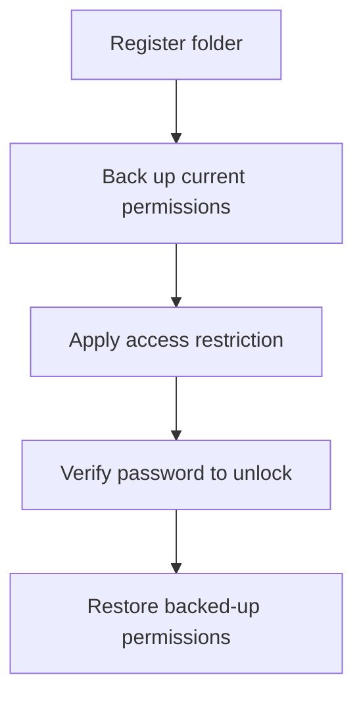

# eslee Folder Locker

Current release preparation: **v1.2.4** — [changes, validation and limits](.github/release-notes/v1.2.4.md).

A local folder-locking app for Windows that restricts access to selected folders and lets you lock and unlock them with a password.

[⬇️ **Download the latest release**](https://github.com/esleeeeee/eslee-folder-locker/releases/latest)

**Document language:** [한국어](README.md) · English

This app does not encrypt your files or move them anywhere. Files stay exactly where they are; the app changes the folder's Windows access permissions (ACL) so your current user account cannot open it. The permissions from before the lock are backed up and restored when you unlock.

It is a good fit for keeping specific folders off-limits when you share one PC and one account with family or friends. It is not a security product against people with administrator rights or Windows permission knowledge — for truly sensitive data, use BitLocker or separate Windows accounts as well.

## What you can do with it

- Lock specific folders so that others using your account cannot open them
- Unlock with a password — permanently, or temporarily for 1 minute to 1 day with automatic re-locking
- Unlock a locked folder straight from the File Explorer right-click menu
- Close the window and keep the app in the system tray (the icon area at the right of the taskbar) for quick access
- Try to restore folder permissions with a separate recovery tool if the main app cannot run

## Download

Open the [latest release page](https://github.com/esleeeeee/eslee-folder-locker/releases/latest) and download the **installer** for your language.

| Your language | File to download |
| --- | --- |
| English | `eslee-folder-locker-setup-vVERSION-en.exe` |
| 한국어 | `eslee-folder-locker-setup-vVERSION-ko.exe` |

- The EXE with `setup` in its name is the installer. That is the file most users need.
- `Source code (zip)` and `Source code (tar.gz)` are source archives that GitHub attaches automatically. **They are not installers** — you can ignore them.
- The `...-win-x64.zip` files are a no-install bundle of the executables. Unless you specifically need that, the installer is recommended.

### Windows may warn you on first run

The installer is not code-signed, so Windows SmartScreen may show a "Windows protected your PC" warning the first time you run it. To continue, click **More info**, then **Run anyway**.

An unsigned file is not automatically unsafe, and a signed one is not automatically safe. What matters is that you downloaded the file from this repository's official Releases page.

## Install

Instructions are for Windows 11. You need an NTFS drive and x64 Windows; if the .NET 8 Desktop Runtime is missing, Windows will offer to install it on first run.

1. Open the [latest release page](https://github.com/esleeeeee/eslee-folder-locker/releases/latest).
2. Download and run the English installer (`...-setup-...-en.exe`).
3. If SmartScreen appears, click **More info** → **Run anyway**.
4. Follow the wizard. The default location is `C:\Program Files\eslee Folder Locker`.
5. Enable the optional tasks if you want them — both are optional and can be changed later.
   - **Create a desktop shortcut**
   - **Start automatically at Windows login (in the tray)**
6. When setup finishes, keep **Launch eslee Folder Locker** checked to start right away.

Installing also registers the File Explorer right-click entry (`Unlock with eslee Folder Locker`).

## First-time setup

### 1. Set the master recovery password

On first launch the app shows the **Set master recovery password** screen. This is not the password you lock folders with — it is a separate password that guards the recovery tool for emergencies.

- Enter the new password and its confirmation, and add a hint if you like.
- Read the warning and tick **I understand that this password cannot be recovered if forgotten** to enable **Complete setup**.
- You can click **Set up later** to skip. Until this password is set you cannot lock folders; clicking Lock will guide you back to this screen.

> **Important:** if you forget the master recovery password, the recovery tool cannot be used. There is no reset, no recovery code, no password lookup, and reinstalling does not reset it. Choose something you can remember, or store it somewhere safe.

### 2. Register a folder and lock it

1. Click **Add folder** in the main window and pick the folder to lock.
2. The first time, set the **folder password** used for unlocking. It must be at least 4 characters and is shared by all registered folders.
3. Choose the lock mode on the right (**Quick mode** or **Hardened mode**).
4. Click **Lock** and review the confirmation dialog.
5. Approve the Windows administrator prompt (UAC) — changing permissions requires admin approval.
6. When the lock finishes, the folder's state in the list changes to `Locked`. Opening it in File Explorer is now denied.

## Which lock mode should I choose?

| Situation | Recommended |
| --- | --- |
| You just want to keep people out of the folder | **Quick mode** |
| You want restrictions applied to every file and subfolder individually | **Hardened mode** |
| The folder has a very large number of files and you want it fast | **Quick mode** |

- **Quick mode** restricts only the selected folder itself. It finishes almost instantly regardless of file count, and is enough for the common goal of blocking File Explorer access.
- **Hardened mode** backs up and restricts the permissions of every file and subfolder. With many items, locking and unlocking take longer and the backups grow.

Hardened mode is not simply "more secure". Quick mode is the right starting point for most people.

## Unlocking

### From the app

1. Select the locked folder in the list and click **Unlock**.
2. Enter the folder password.
3. Pick an option under **Unlock duration**:
   - **Unlock permanently**: stays unlocked until you lock it again.
   - **1 minute / 5 minutes / 10 minutes / 30 minutes / 1 hour / 1 day**: automatically re-locks after the selected time.
4. Approve the administrator prompt (UAC). The unlocked folder then opens in File Explorer.

### From File Explorer

1. Right-click the locked folder.
2. On Windows 11 the entry may be under **Show more options**; holding `Shift` while right-clicking opens the full menu directly.
3. Choose **Unlock with eslee Folder Locker**.
4. Enter the folder password and pick the unlock duration.

### Temporary unlock and automatic re-locking

When you unlock with a time limit, the app re-locks the folder when the time expires. If the PC was shut down or you logged out before that, the app checks at your next Windows login and re-locks — immediately if the time has already passed.

Timed unlock schedules an automatic re-lock, so it is available only after the master recovery password has been set. Permanent unlock is always available.

The login resume runner isolates failures per folder. A failed folder gets up to two more attempts after 30 and 60 seconds while other folders continue. Failures preserve access and recovery information and appear in the main window’s last operation time and result. If retries are exhausted, review that result and re-lock manually. Corrupt security credentials prevent new lock attempts.

## Using the system tray

While the app runs, an icon sits in the system tray.

- **Clicking the window's X button hides the app to the tray instead of exiting.** No balloon, toast, or popup is shown. The app may look gone, but it keeps running in the tray.
- **Double-click** the tray icon to reopen the main window.
- **Right-click** the tray icon for the menu:
  - **Open eslee Folder Locker**: open the main window
  - **Locked folders**: the current list of locked folders — selecting one opens the password prompt directly
  - **Open recovery tool**
  - **Settings**
  - **Exit**: quit the app completely
- To quit completely, use **Exit** in the tray menu.
- If you prefer the X button to really exit, change **When the main window is closed** to **Exit the app completely** in **Settings**.
- Only one instance runs at a time. Launching the app again brings the existing window to the front instead of opening a new one.

## Folder password vs. master recovery password

The app uses two different passwords.

| Password | Where it is used |
| --- | --- |
| Folder password | Normal unlocking (app, Explorer right-click, tray) |
| Master recovery password | Entering the recovery tool |

- They are not interchangeable. The master recovery password cannot unlock folders normally, and the folder password cannot open the recovery tool.
- The master recovery password only needs to be non-empty. There are no length or character rules and no limit on failed attempts. A password made only of spaces is technically allowed but easy to get wrong later, so it is not recommended.
- The hint is optional. It is stored unencrypted and anyone at the recovery tool screen can view it — never write the password itself into the hint.
- Both passwords can be changed from the main window: **Change password** (folder), **Change master password**, and **Change recovery hint**. Changing always requires the current password.

> **Once more:** a forgotten master recovery password cannot be recovered, and the recovery tool becomes unusable.

## Recovery tool

The recovery tool is a separate program for these situations:

- Unlocking from the main app does not work correctly
- You need to restore a folder to its pre-lock permissions from a saved backup

How it works:

- Start it with the **Open recovery tool** button in the main window or the Start menu shortcut.
- After approving the administrator prompt (UAC), you must enter the **master recovery password**. Until the password is correct, no folder or backup information is shown at all.
- After authenticating, choose the folder and backup, then type `RESTORE` when prompted to run the restore.
- The tool depends on saved backups. If backup files were deleted or damaged, recovery may not be possible.
- The recovery tool is **not a password reset tool.** It cannot recover a forgotten folder password or master recovery password.

See the [recovery guide](docs/recovery-guide.md) for details.

## Start at Windows login

Auto-start is optional.

- You can enable it during installation with **Start automatically at Windows login (in the tray)**.
- After installation, toggle it any time in the app's **Settings**.
- When auto-started, the app begins quietly in the tray without opening the main window.
- During a quiet tray start, first-run setup and data migration prompts are skipped; they appear the next time you open the app normally.

## Uninstall, update, reinstall

- **Update**: running a newer installer upgrades in place. Settings, registered folders, permission backups, and password data are kept.
- **Uninstall**: if locked folders remain, the uninstaller warns you and cancels by default. Fully unlock all folders in the app before uninstalling.
- Uninstalling never auto-deletes your data (settings, permission backups, master password data, logs). It stays under `%LOCALAPPDATA%\eslee-folder-locker`.
- **Reinstalling** picks that data up again. Even if you uninstalled with folders still locked, installing again lets you continue unlocking and recovery.

> **Caution:** deleting the `%LOCALAPPDATA%\eslee-folder-locker` folder by hand is not a reset method. Removing the permission backups and security data there can make locked folders unrecoverable. Before deleting it, make absolutely sure no folder is still locked.

## Good to know

- Runs on Windows 11, NTFS drives, x64.
- Locking, unlocking, and recovery need a Windows administrator (UAC) approval. Normal app use does not.
- No encryption. It cannot stop administrators on the same account, users who can edit permissions, or someone reading the disk from another OS.
- There are no accounts, ads, analytics, or auto-updates. The app's only internet access is querying GitHub's public release information to check for a new version; if that check fails, locking is unaffected.
- The installer is not code-signed, so SmartScreen may warn on first run.
- A forgotten master recovery password cannot be recovered.
- Permission backup files are stored unencrypted in the user data folder.
- Dangerous paths cannot be locked: entire drives (`C:\` etc.), Windows system folders, Program Files, the whole user profile, and the OneDrive root.
- Korean and English are supported; the language is chosen by which installer you download.

## Privacy and local data

The app's only internet access is the update check: an anonymous query of GitHub's public release information that sends none of your data. When a new version exists the app only tells you — it never installs anything by itself. Settings, registered folder information, permission backups, security data, and logs are stored on your PC under `%LOCALAPPDATA%\eslee-folder-locker`. If you use the Explorer right-click menu or auto-start, the matching launch entries are also added to the Windows per-user registry; they are removed when you turn those features off in the app or uninstall.

What is stored under `%LOCALAPPDATA%\eslee-folder-locker`:

- The paths and lock states of registered folders
- The original password is not stored. The app stores only a hash and salt used to verify password attempts.
- The master password hint is stored as you typed it (plain text).
- Pre-lock permission backups (unencrypted)
- Operation logs (may include operation type, time, and target folder paths)

When attaching logs to a GitHub issue, remove or mask personal folder names and paths first.

## Troubleshooting

### Windows blocks the installer

- **Check first**: make sure the file came from this repository's [official releases page](https://github.com/esleeeeee/eslee-folder-locker/releases/latest).
- **Fix**: if the file did come from the official releases page, click **More info** → **Run anyway** in the SmartScreen dialog. The warning may appear because the installer is unsigned.

### I can't add a folder

- **Check first**: entire drives, Windows system folders, Program Files, the whole user profile, and the OneDrive root cannot be registered. Removable drives and non-NTFS drives are not supported.
- **Fix**: pick a regular folder on a local fixed NTFS drive — for example, a specific subfolder inside Documents.

### I cancelled the administrator prompt during lock/unlock

- **Symptom**: a message like "UAC elevation was canceled" appears and nothing changes.
- **Fix**: changing permissions requires admin approval. Run the same action again and click **Yes** this time. Cancelling does not leave the folder in a broken state.

### I clicked X and the app disappeared

- **Symptom**: the window closed but the app seems to still be doing things.
- **Explanation**: it did not exit — it moved to the system tray, silently by design.
- **Fix**: double-click the tray icon, or right-click it and choose **Open eslee Folder Locker**. Use **Exit** in the tray menu to quit completely. You can make X really exit under **Settings**.

### The Explorer right-click entry is missing

- **Check first**: on Windows 11 it may be under **Show more options**, or use `Shift + right-click`.
- **Fix**: if it is still missing, click **Register Explorer menu** in the app's main window.

### A temporary unlock didn't re-lock

- **Check first**: automatic re-locking works while you are logged in. If the PC was off, it re-locks after your next login.
- **Fix**: to re-lock immediately, select the folder in the app and click **Lock**. If it keeps happening, check **View logs** for errors.

### I forgot the master recovery password

- Unfortunately there is no way back. There is no reset, no recovery code, no administrator or developer override, and the password cannot be replaced without knowing the current one.
- **Normal unlocking still works if you know the folder password.** However, there is no way to view or replace a forgotten master recovery password, and the recovery tool stays unusable.
- Deleting the security data file is not a fix and makes recovery harder.

### The recovery tool won't run

- **Check first**: make sure you did not cancel the administrator prompt, and that a master recovery password has been set — the tool is unavailable before that.
- **Fix**: reinstall the latest version. If it still fails, open a [GitHub issue](https://github.com/esleeeeee/eslee-folder-locker/issues) with the contents of **View logs** (personal paths removed).

### The uninstaller warns about locked folders

- **Explanation**: uninstalling with folders still locked makes later unlocking awkward, so the uninstaller cancels by default.
- **Fix**: open the app, fully unlock every folder, then uninstall. If you already uninstalled, reinstalling picks up the existing data so you can continue.

If your problem is not solved, open a [GitHub issue](https://github.com/esleeeeee/eslee-folder-locker/issues) with the symptom, the steps to reproduce it, and the log contents (personal paths removed).

## How it works

In short:



1. Before locking, the app backs up the folder's Windows access permissions.
2. It then adds a restriction so your current account cannot access the folder.
3. Unlocking removes that restriction or restores the backed-up permissions.
4. If something goes wrong, the recovery tool tries to restore permissions from the saved backup.

For internals, see the [architecture](docs/architecture.md) and [ACL design](docs/acl-design.md) documents.

## Developer documentation

Building requires the .NET 8 SDK.

```powershell
git clone https://github.com/esleeeeee/eslee-folder-locker.git
Set-Location eslee-folder-locker
dotnet build .\FolderGate.sln -p:AppLanguage=en
dotnet test .\FolderGate.sln --filter "TestCategory!=RequiresElevation"
```

Build the Korean UI with `-p:AppLanguage=ko`. Installers are built with `installer\Build-Installers.ps1` (requires Inno Setup 6).

- [Architecture](docs/architecture.md) — project layout, data paths, master password design
- [ACL design](docs/acl-design.md) — how permissions are changed
- [Recovery guide](docs/recovery-guide.md) — detailed recovery tool usage
- [Limitations](docs/limitations.md) — the security model's boundaries
- [Test results](docs/test-results.md) — how to run the tests and what they cover
- [CHANGELOG](CHANGELOG.md) — version history

The internal project name and namespaces remain `FolderGate` for compatibility. The project was developed end to end through vibe coding with an AI coding agent.

## License

No separate license file is currently provided.
