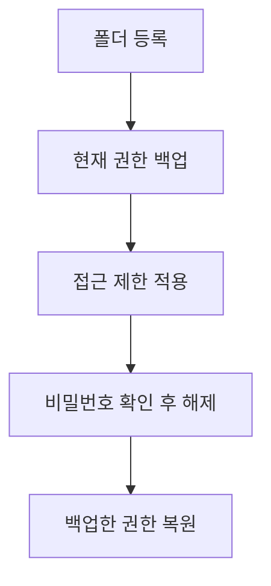

# eslee폴더잠금기

현재 릴리스 준비 버전: **v1.2.4** — [변경·검증·제한](.github/release-notes/v1.2.4.md).

Windows 폴더에 접근 제한을 적용하고, 비밀번호로 잠금과 해제를 관리할 수 있는 로컬 폴더 잠금 프로그램입니다.

[⬇️ **최신 버전 다운로드**](https://github.com/esleeeeee/eslee-folder-locker/releases/latest)

**문서 언어:** 한국어 · [English](README.en.md)

이 프로그램은 파일을 암호화하거나 다른 곳으로 옮기지 않습니다. 파일은 원래 위치에 그대로 두고, Windows의 폴더 접근 권한(ACL)을 바꿔서 현재 사용자 계정이 폴더를 열지 못하게 막습니다. 잠그기 전의 권한은 백업해 두었다가 잠금을 해제할 때 되돌립니다.

가족이나 지인과 한 대의 PC를 함께 쓸 때 특정 폴더를 간단히 막아두는 용도에 적합합니다. 관리자 권한이 있거나 Windows 권한 설정을 다룰 줄 아는 사람까지 막는 보안 제품은 아니므로, 정말 중요한 자료에는 BitLocker나 Windows 계정 분리를 함께 사용하세요.

## 이 프로그램으로 할 수 있는 일

- 다른 사람이 내 계정으로 PC를 쓸 때 특정 폴더를 열지 못하게 잠그기
- 잠긴 폴더를 비밀번호로 완전히 풀거나, 1분~하루 동안만 잠깐 풀었다가 자동으로 다시 잠그기
- 파일 탐색기에서 잠긴 폴더를 우클릭해 바로 잠금 해제
- 창을 닫아도 시스템 트레이(작업 표시줄 오른쪽 아이콘 영역)에 남겨 두고 빠르게 다시 열기
- 앱이 정상 실행되지 않을 때 별도의 복구 도구로 폴더 권한 복원 시도

## 다운로드

[최신 버전 페이지](https://github.com/esleeeeee/eslee-folder-locker/releases/latest)에서 사용하는 언어에 맞는 **설치 파일**을 내려받으세요.

| 사용하는 언어 | 내려받을 파일 |
| --- | --- |
| 한국어 | `eslee-folder-locker-setup-v버전-ko.exe` |
| English | `eslee-folder-locker-setup-v버전-en.exe` |

- 파일 이름에 `setup`이 들어간 EXE가 설치 파일입니다. 일반 사용자는 이 파일을 받으면 됩니다.
- `Source code (zip)`과 `Source code (tar.gz)`는 GitHub가 자동으로 첨부하는 소스 코드 묶음입니다. **설치 파일이 아니므로** 내려받지 않아도 됩니다.
- `...-win-x64.zip` 파일은 설치 없이 압축을 풀어 쓰는 실행 파일 묶음입니다. 특별한 이유가 없다면 설치 파일을 권장합니다.

### 실행 시 Windows 경고가 뜰 수 있습니다

설치 파일에는 코드 서명이 없습니다. 그래서 처음 실행할 때 Windows SmartScreen이 "Windows의 PC 보호" 경고를 표시할 수 있습니다. 계속하려면 경고 창에서 **추가 정보**를 누른 뒤 **실행**을 선택하세요.

경고가 뜨지 않는 파일이라고 해서 안전한 것도, 뜨는 파일이라고 해서 위험한 것도 아닙니다. 이 저장소의 공식 Release 페이지에서 내려받은 파일인지 먼저 확인하세요.

## 설치

Windows 11 기준입니다. NTFS 드라이브와 x64 Windows가 필요하며, .NET 8 Desktop Runtime이 없는 PC에서는 실행 시 설치 안내가 표시될 수 있습니다.

1. [최신 버전 페이지](https://github.com/esleeeeee/eslee-folder-locker/releases/latest)를 엽니다.
2. 한국어 설치 파일(`...-setup-...-ko.exe`)을 내려받아 실행합니다.
3. SmartScreen 경고가 뜨면 **추가 정보** → **실행**을 누릅니다.
4. 설치 마법사에서 설치 위치를 확인하고 진행합니다. 기본 위치는 `C:\Program Files\eslee Folder Locker`입니다.
5. 필요하면 선택 항목을 켭니다. 둘 다 선택 사항이며 나중에 바꿀 수 있습니다.
   - **바탕화면 바로가기 만들기**
   - **Windows 로그인 시 자동 실행 (트레이로 시작)**
6. 설치가 끝나면 **eslee폴더잠금기 실행**을 선택해 바로 시작할 수 있습니다.

설치하면 파일 탐색기 우클릭 메뉴(`eslee폴더잠금기로 잠금 해제`)도 함께 등록됩니다.

## 처음 사용하는 방법

### 1. 마스터 복구 비밀번호 설정

앱을 처음 실행하면 **마스터 복구 비밀번호 설정** 화면이 나타납니다. 이 비밀번호는 폴더를 잠글 때 쓰는 비밀번호가 아니라, 문제가 생겼을 때 복구 도구에 들어가기 위한 별도의 비밀번호입니다.

- 새 비밀번호와 확인 값을 입력하고, 필요하면 힌트를 적습니다.
- 경고 내용을 읽고 **비밀번호를 잊으면 복구할 수 없다는 사실을 이해했습니다** 체크박스를 선택해야 **설정 완료**를 누를 수 있습니다.
- **나중에 설정**을 눌러 건너뛸 수도 있습니다. 다만 이 비밀번호를 설정하기 전에는 폴더를 잠글 수 없고, 잠금 버튼을 누르면 설정 화면으로 안내됩니다.

> **중요:** 마스터 복구 비밀번호를 잊으면 복구 도구를 사용할 수 없습니다. 초기화 기능, 복구 코드, 비밀번호 찾기가 없고 프로그램을 다시 설치해도 초기화되지 않습니다. 기억할 수 있는 값으로 정하거나 안전한 곳에 따로 적어 두세요.

### 2. 폴더 등록과 첫 잠금

1. 메인 화면에서 **폴더 추가**를 눌러 잠글 폴더를 선택합니다.
2. 처음 등록할 때 폴더 잠금 해제에 사용할 **폴더 비밀번호**를 설정합니다. 이 비밀번호는 최소 4자 이상이어야 하며, 등록된 모든 폴더에 공통으로 사용됩니다.
3. 화면 오른쪽에서 잠금 모드(**빠른 모드** 또는 **강화 모드**)를 선택합니다.
4. **잠금**을 누르고 확인 창에서 내용을 확인합니다.
5. Windows 관리자 권한 요청(UAC) 창이 뜨면 **예**를 선택합니다. 권한 변경에는 관리자 승인이 필요합니다.
6. 잠금이 끝나면 목록에서 폴더 상태가 `잠김`으로 바뀝니다. 파일 탐색기에서 해당 폴더를 열면 접근이 거부됩니다.

## 어떤 잠금 모드를 선택해야 하나요?

| 상황 | 추천 |
| --- | --- |
| 폴더를 열지 못하게만 막으면 충분함 | **빠른 모드** |
| 폴더 안의 파일과 하위 폴더 하나하나에도 제한을 적용하고 싶음 | **강화 모드** |
| 파일 수가 매우 많아 처리 시간을 줄이고 싶음 | **빠른 모드** |

- **빠른 모드**는 선택한 폴더 자체에만 제한을 적용합니다. 파일 수와 관계없이 거의 즉시 끝나며, 파일 탐색기로 폴더에 들어가는 것을 막는 일반적인 용도에 충분합니다.
- **강화 모드**는 하위 파일과 폴더 각각의 권한을 백업하고 제한을 적용합니다. 항목 수가 많으면 잠금과 해제에 시간이 걸리고, 백업할 데이터도 늘어납니다.

강화 모드가 항상 더 좋은 것은 아닙니다. 대부분의 경우 빠른 모드로 시작하는 것을 권장합니다.

## 잠금 해제하기

### 앱에서 해제

1. 목록에서 잠긴 폴더를 선택하고 **잠금 해제**를 누릅니다.
2. 폴더 비밀번호를 입력합니다.
3. **잠금 해제 유지 시간**에서 원하는 방식을 선택합니다.
   - **완전 해제**: 다시 잠글 때까지 계속 열려 있습니다.
   - **1분 / 5분 / 10분 / 30분 / 1시간 / 하루**: 선택한 시간이 지나면 자동으로 다시 잠급니다.
4. 관리자 권한 요청(UAC)을 승인하면 해제가 진행되고, 해제된 폴더가 파일 탐색기로 열립니다.

### 파일 탐색기에서 해제

1. 잠긴 폴더를 우클릭합니다.
2. Windows 11에서는 메뉴가 **더 많은 옵션 표시** 안에 있을 수 있습니다. `Shift`를 누른 채 우클릭하면 전체 메뉴가 바로 열립니다.
3. **eslee폴더잠금기로 잠금 해제**를 선택합니다.
4. 폴더 비밀번호를 입력하고 해제 시간을 선택합니다.

### 임시 해제와 자동 재잠금

시간을 선택해 해제하면 만료 시각에 맞춰 자동으로 다시 잠급니다. 해제 시간이 남았는데 PC를 끄거나 로그아웃한 경우에는, 다음에 Windows에 로그인했을 때 남은 시간을 확인해 다시 잠급니다. 이미 시간이 지났다면 로그인 직후 바로 다시 잠급니다.

시간제 해제는 자동 재잠금 예약을 만들기 때문에, 마스터 복구 비밀번호를 설정한 뒤에만 사용할 수 있습니다. 완전 해제는 언제나 사용할 수 있습니다.

로그인 후 재개하는 재잠금 작업은 폴더별 오류를 분리합니다. 실패한 폴더는 30초, 60초 간격으로 최대 두 번 더 시도하며 다른 폴더의 재잠금은 계속합니다. 실패 시 접근 가능한 상태와 복구 정보를 유지하고, 메인 화면의 마지막 작업 시각·결과에 오류를 기록합니다. 계속 실패하면 해당 결과를 확인하고 수동으로 다시 잠그세요. 보안 정보가 손상된 경우 새 잠금은 시도하지 않습니다.

## 시스템 트레이 사용

앱이 실행 중이면 시스템 트레이에 아이콘이 표시됩니다.

- 창의 **X 버튼을 누르면 앱이 종료되지 않고 트레이로 숨습니다.** 이때 풍선 알림이나 팝업은 표시되지 않습니다. 앱이 사라진 것처럼 보여도 트레이에서 계속 실행 중입니다.
- 트레이 아이콘을 **더블 클릭**하면 메인 창이 다시 열립니다.
- 트레이 아이콘을 **우클릭**하면 다음 메뉴를 사용할 수 있습니다.
  - **eslee폴더잠금기 열기**: 메인 창 열기
  - **잠긴 폴더**: 현재 잠긴 폴더 목록. 폴더를 선택하면 바로 비밀번호 입력 창이 열립니다.
  - **복구 도구 열기**
  - **설정**
  - **종료**: 앱을 완전히 종료
- 앱을 완전히 종료하려면 트레이 메뉴의 **종료**를 사용하세요.
- X 버튼으로 앱이 바로 종료되기를 원하면 **설정**에서 `메인 창을 닫을 때`를 **앱을 완전히 종료**로 바꾸면 됩니다.
- 앱은 한 번에 하나만 실행됩니다. 이미 실행 중일 때 다시 실행하면 새 창 대신 기존 창이 앞으로 나타납니다.

## 폴더 비밀번호와 마스터 복구 비밀번호

이 프로그램에는 서로 다른 두 개의 비밀번호가 있습니다.

| 비밀번호 | 사용하는 곳 |
| --- | --- |
| 폴더 비밀번호 | 일반적인 잠금 해제 (앱, 탐색기 우클릭, 트레이) |
| 마스터 복구 비밀번호 | 복구 도구 진입 |

- 두 비밀번호는 서로 대체할 수 없습니다. 마스터 복구 비밀번호로 일반 잠금 해제를 할 수 없고, 폴더 비밀번호로 복구 도구에 들어갈 수 없습니다.
- 마스터 복구 비밀번호는 빈 값만 아니면 됩니다. 길이나 문자 종류 제한이 없고, 입력 실패 횟수 제한도 없습니다. 공백만으로 된 비밀번호도 기술적으로는 가능하지만 나중에 혼동하기 쉬우므로 권장하지 않습니다.
- 힌트는 선택 사항입니다. 힌트는 암호화되지 않은 상태로 저장되고 복구 도구 화면에서 누구나 볼 수 있으므로, 힌트에 비밀번호 자체를 적지 마세요.
- 두 비밀번호 모두 메인 화면의 **비밀번호 변경**(폴더), **마스터 비밀번호 변경**, **복구 힌트 변경** 버튼으로 바꿀 수 있습니다. 바꿀 때는 항상 현재 비밀번호가 필요합니다.

> **다시 한번:** 마스터 복구 비밀번호를 잊으면 복구 도구를 사용할 수 없고, 이를 되살릴 방법이 없습니다.

## 복구 도구

복구 도구는 다음 상황을 위한 별도 프로그램입니다.

- 메인 앱에서 잠금 해제가 정상적으로 되지 않을 때
- 저장된 권한 백업으로 폴더를 잠그기 전 상태로 되돌려야 할 때

사용 방법과 특징:

- 메인 화면의 **복구 도구 열기** 버튼이나 시작 메뉴의 복구 도구 바로가기로 실행합니다.
- 실행하면 관리자 권한 요청(UAC)을 승인한 뒤 **마스터 복구 비밀번호**를 입력해야 합니다. 비밀번호를 맞히기 전에는 폴더 목록이나 백업 정보가 전혀 표시되지 않습니다.
- 인증 후 복구할 폴더와 백업을 선택하고, 안내에 따라 `RESTORE`를 입력하면 복구가 실행됩니다.
- 복구 도구는 저장된 백업이 있어야 동작합니다. 백업 파일이 삭제되거나 손상되면 복구하지 못할 수 있습니다.
- 복구 도구는 **잊어버린 비밀번호를 초기화하는 도구가 아닙니다.** 폴더 비밀번호나 마스터 복구 비밀번호를 되찾아 주지 않습니다.

자세한 단계는 [복구 가이드](docs/recovery-guide.md)를 참고하세요.

## Windows 로그인 시 자동 실행

자동 실행은 선택 기능입니다.

- 설치할 때 **Windows 로그인 시 자동 실행 (트레이로 시작)** 항목으로 켤 수 있습니다.
- 설치 후에는 앱의 **설정**에서 언제든지 켜거나 끌 수 있습니다.
- 자동 실행되면 메인 창을 띄우지 않고 트레이 아이콘만 조용히 시작합니다.
- 조용한 시작 중에는 최초 설정이나 데이터 이전 안내 창이 표시되지 않으며, 다음에 직접 실행할 때 표시됩니다.

## 제거, 업데이트, 재설치

- **업데이트**: 새 설치 파일을 실행하면 기존 설치 위에 덮어씁니다. 설정, 등록 폴더, 권한 백업, 비밀번호 데이터는 그대로 유지됩니다.
- **제거**: 잠긴 폴더가 남아 있으면 제거 프로그램이 경고를 표시하고 기본적으로 제거를 취소합니다. 제거 전에 먼저 앱에서 모든 폴더를 완전 해제하세요.
- 제거해도 사용자 데이터(설정, 권한 백업, 마스터 복구 비밀번호 데이터, 로그)는 자동으로 삭제되지 않습니다. 데이터는 `%LOCALAPPDATA%\eslee-folder-locker` 폴더에 남습니다.
- **재설치**하면 남아 있는 데이터를 그대로 다시 인식합니다. 잠긴 폴더가 있는 상태로 제거했더라도, 다시 설치하면 해제와 복구를 이어서 할 수 있습니다.

> **주의:** `%LOCALAPPDATA%\eslee-folder-locker` 폴더를 직접 삭제하는 것은 초기화 방법이 아닙니다. 이 폴더의 권한 백업과 보안 데이터를 지우면 잠긴 폴더를 복구하지 못하게 될 수 있습니다. 삭제하기 전에 잠긴 폴더가 하나도 없는지 반드시 확인하세요.

## 꼭 알아둘 점

- Windows 11, NTFS 드라이브, x64 환경에서 동작합니다.
- 잠금, 해제, 복구에는 Windows 관리자 권한 요청(UAC) 승인이 필요합니다. 평소 앱 사용에는 필요 없습니다.
- 파일을 암호화하지 않습니다. 같은 계정의 관리자 권한 사용자, 권한 설정을 다룰 줄 아는 사용자, 다른 OS로 디스크를 읽는 경우는 막지 못합니다.
- 계정 가입, 광고, 사용 통계 수집, 자동 업데이트가 없습니다. 인터넷 접근은 새 버전 확인을 위해 GitHub의 공개 Release 정보를 조회하는 것 하나뿐이며, 확인에 실패해도 잠금 기능에는 영향이 없습니다.
- 설치 파일에 코드 서명이 없어 SmartScreen 경고가 표시될 수 있습니다.
- 마스터 복구 비밀번호는 분실 시 복구할 수 없습니다.
- 권한 백업 파일은 암호화되지 않은 상태로 사용자 데이터 폴더에 저장됩니다.
- 드라이브 전체(`C:\` 등), Windows 시스템 폴더, Program Files, 사용자 프로필 전체, OneDrive 최상위 폴더 같은 위험한 경로는 잠글 수 없게 막혀 있습니다.
- 한국어와 영어를 지원하며, 언어는 설치 파일 선택으로 결정됩니다.

## 개인정보와 로컬 데이터

이 프로그램이 인터넷에 접근하는 경우는 업데이트 확인 하나뿐입니다. 업데이트 확인은 GitHub의 공개 Release 정보를 익명으로 조회하기만 하며, 내 PC의 어떤 데이터도 외부로 보내지 않습니다. 새 버전이 있으면 알려줄 뿐 자동으로 설치하지 않습니다. 설정, 등록 폴더 정보, 권한 백업, 보안 정보와 로그는 내 PC의 `%LOCALAPPDATA%\eslee-folder-locker` 폴더에 저장됩니다. 탐색기 우클릭 메뉴나 자동 실행 기능을 사용하면 Windows 사용자 레지스트리에도 해당 실행 등록 정보가 추가되며, 앱이나 제거 프로그램에서 해당 기능을 끄면 함께 정리됩니다.

`%LOCALAPPDATA%\eslee-folder-locker`에 저장되는 내용은 다음과 같습니다.

- 등록한 폴더의 경로와 잠금 상태
- 비밀번호 원문은 저장하지 않습니다. 비밀번호 확인에 사용하는 hash와 salt만 저장합니다.
- 마스터 복구 비밀번호의 힌트는 입력한 그대로(평문) 저장됩니다.
- 잠그기 전 폴더 권한의 백업(암호화되지 않음)
- 작업 로그(작업 종류, 시각, 대상 폴더 경로 포함 가능)

GitHub Issues에 로그를 올려 문제를 신고할 때는, 로그에 포함된 개인 폴더 이름과 경로를 지우거나 가린 뒤 올리세요.

## 문제 해결

### Windows가 설치 파일 실행을 차단해요

- **먼저 확인**: 이 저장소의 [공식 Release 페이지](https://github.com/esleeeeee/eslee-folder-locker/releases/latest)에서 받은 파일인지 확인하세요.
- **해결**: 공식 Release에서 받은 파일이 맞다면 SmartScreen 경고 창에서 **추가 정보** → **실행**을 누릅니다. 설치 파일에 코드 서명이 없어 SmartScreen 경고가 표시될 수 있습니다.

### 폴더를 추가할 수 없어요

- **먼저 확인**: 드라이브 전체, Windows 시스템 폴더, Program Files, 사용자 프로필 전체, OneDrive 최상위 폴더는 등록할 수 없습니다. USB 메모리나 외장 드라이브, NTFS가 아닌 드라이브도 지원하지 않습니다.
- **해결**: 로컬 고정 드라이브(NTFS)의 일반 폴더를 선택하세요. 예를 들어 문서 안의 특정 하위 폴더는 가능합니다.

### 잠금이나 해제 중 관리자 권한 창을 취소했어요

- **증상**: "UAC 승격이 취소되었습니다" 같은 메시지가 표시되고 작업이 진행되지 않습니다.
- **해결**: 폴더 권한을 바꾸려면 관리자 승인이 필요합니다. 같은 작업을 다시 실행하고 이번에는 **예**를 선택하세요. 취소해도 폴더가 어중간한 상태로 남지 않습니다.

### X 버튼을 눌렀는데 앱이 사라졌어요

- **증상**: 창이 닫혔는데 작업이 계속되는 것 같습니다.
- **설명**: 종료된 것이 아니라 시스템 트레이로 이동한 것입니다. 이때 알림은 표시되지 않습니다.
- **해결**: 작업 표시줄 오른쪽 트레이에서 앱 아이콘을 더블 클릭하거나, 우클릭 후 **eslee폴더잠금기 열기**를 선택하세요. 완전히 종료하려면 트레이 메뉴의 **종료**를 누르세요. X 버튼으로 바로 종료되게 하려면 **설정**에서 바꿀 수 있습니다.

### 탐색기 우클릭 메뉴가 안 보여요

- **먼저 확인**: Windows 11에서는 **더 많은 옵션 표시**를 누르거나 `Shift + 우클릭`해야 보일 수 있습니다.
- **해결**: 그래도 없다면 앱 메인 화면에서 **탐색기 메뉴 등록** 버튼을 눌러 다시 등록하세요.

### 임시 해제했는데 다시 잠기지 않아요

- **먼저 확인**: 자동 재잠금은 로그인 상태에서 동작합니다. PC가 꺼져 있었다면 다음 로그인 후에 다시 잠급니다.
- **해결**: 급하면 앱에서 해당 폴더를 선택하고 **잠금**을 눌러 직접 다시 잠글 수 있습니다. 문제가 반복되면 **로그 보기**에서 오류를 확인하세요.

### 마스터 복구 비밀번호를 잊었어요

- 안타깝지만 되찾을 방법이 없습니다. 초기화 기능, 복구 코드, 관리자 우회, 개발자 문의를 통한 해제가 모두 없으며, 현재 마스터 비밀번호를 모르면 새 값으로 교체할 수도 없습니다.
- **폴더 비밀번호를 알고 있다면 일반 잠금 해제는 계속 사용할 수 있습니다.** 하지만 잊어버린 마스터 복구 비밀번호를 확인하거나 교체할 방법은 없으며, 복구 도구는 사용할 수 없습니다.
- 보안 데이터 파일을 삭제하는 방식은 해결책이 아니며, 오히려 복구를 더 어렵게 만듭니다.

### 복구 도구가 실행되지 않아요

- **먼저 확인**: 관리자 권한 요청(UAC)을 취소하지 않았는지, 마스터 복구 비밀번호를 설정했는지 확인하세요. 마스터 비밀번호를 설정하기 전에는 복구 도구를 사용할 수 없습니다.
- **해결**: 프로그램을 최신 버전으로 다시 설치해 보세요. 계속 실패하면 **로그 보기**의 내용(개인 경로는 지우고)과 함께 [GitHub Issues](https://github.com/esleeeeee/eslee-folder-locker/issues)로 알려주세요.

### 제거하려는데 잠긴 폴더가 있다는 경고가 떠요

- **설명**: 잠긴 폴더가 남은 채 제거하면 나중에 해제가 번거로워질 수 있어, 제거 프로그램이 기본적으로 제거를 취소합니다.
- **해결**: 먼저 앱을 열어 모든 폴더를 **완전 해제**한 뒤 다시 제거하세요. 이미 제거해 버렸다면 다시 설치하면 기존 데이터를 인식하므로 해제를 이어서 할 수 있습니다.

문제가 해결되지 않으면 [GitHub Issues](https://github.com/esleeeeee/eslee-folder-locker/issues)에 증상, 재현 순서, 로그 내용(개인 경로 제거 후)을 남겨 주세요.

## 작동 원리

프로그램의 동작을 간단히 요약하면 다음과 같습니다.



1. 잠그기 전에 폴더의 Windows 접근 권한을 백업합니다.
2. 현재 사용자 계정이 폴더에 접근하지 못하도록 제한을 추가합니다.
3. 해제할 때는 추가한 제한을 제거하거나 백업한 권한을 되돌립니다.
4. 문제가 생기면 복구 도구가 저장된 백업으로 권한 복원을 시도합니다.

자세한 내부 구조는 [아키텍처 문서](docs/architecture.md)와 [ACL 설계 문서](docs/acl-design.md)를 참고하세요.

## 개발자용 문서

빌드하려면 .NET 8 SDK가 필요합니다.

```powershell
git clone https://github.com/esleeeeee/eslee-folder-locker.git
Set-Location eslee-folder-locker
dotnet build .\FolderGate.sln -p:AppLanguage=ko
dotnet test .\FolderGate.sln --filter "TestCategory!=RequiresElevation"
```

영어 UI는 `-p:AppLanguage=en`으로 빌드합니다. 설치 파일은 `installer\Build-Installers.ps1`로 생성합니다(Inno Setup 6 필요).

- [아키텍처](docs/architecture.md) — 프로젝트 구조, 데이터 경로, 마스터 비밀번호 설계
- [ACL 설계](docs/acl-design.md) — 권한 변경 방식
- [복구 가이드](docs/recovery-guide.md) — 복구 도구 상세 사용법
- [제한사항](docs/limitations.md) — 보안 모델의 한계
- [테스트 결과](docs/test-results.md) — 테스트 실행 방법과 범위
- [CHANGELOG](CHANGELOG.md) — 버전별 변경 이력

내부 프로젝트명과 네임스페이스는 호환성을 위해 `FolderGate`를 유지합니다. 이 프로젝트는 전 과정을 AI 코딩 에이전트와의 바이브코딩으로 개발했습니다.

## 라이선스

현재 별도의 라이선스 파일이 제공되지 않습니다.
